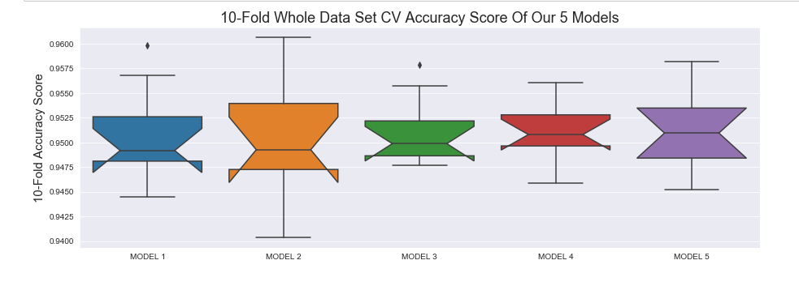
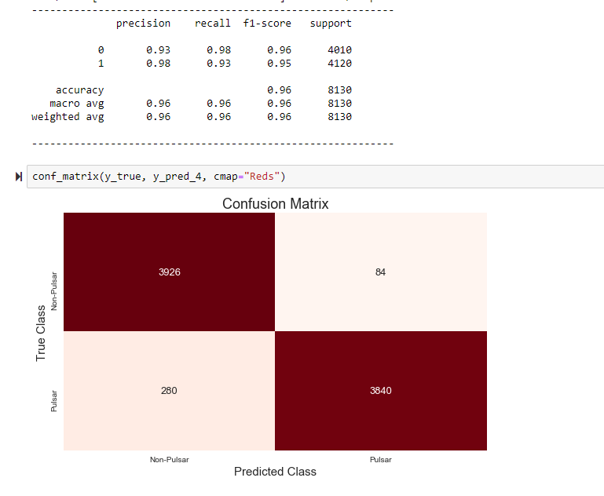
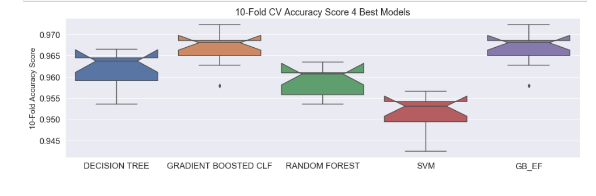
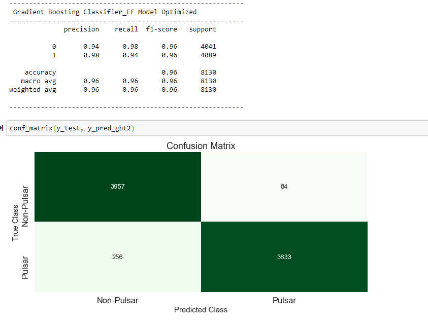

# MOD-4-Final Project: Deep Learning and Machine Learning Classification of Pulsar Stars

# Introduction: Comparison of DL and ML Models for Classifying Pulsar Stars
- HTRU2 is a data set which describes a sample of pulsar candidates collected during the High Time Resolution Universe Survey.
- Pulsars are a rare type of Neutron star that produce radio emission detectable here on Earth. They are of considerable scientific interest as probes of space-time, the inter-stellar medium, and states of matter.
- As pulsars rotate, their emission beam sweeps across the sky, and when this crosses our line of sight, produces a detectable pattern of broadband radio emission. As pulsars rotate rapidly, this pattern repeats periodically. Thus pulsar search involves looking for periodic radio signals with large radio telescopes.
- We will be using Deep Learning and Machine Learning to identify Pulsar Stars and make predictions based on these patterns

# The Pulsar Stars Dataset
- Mean of the integrated profile.
- Standard deviation of the integrated profile.
- Excess kurtosis of the integrated profile.
- Skewness of the integrated profile.
- Mean of the DM-SNR curve.
- Standard deviation of the DM-SNR curve.
- Excess kurtosis of the DM-SNR curve.
- Skewness of the DM-SNR curve.
- Class

# Results: Deep Learning Models

# Results: Best Keras Deep Learning Model (Model 4) Classification Report and Confusion Matrix
- model4 = Sequential()
- model4.add(Dense(100, activation="relu", input_dim=8))
- model4.add(Dropout(0.5))
- model4.add(Dense(50, activation="relu"))
- model4.add(Dropout(0.5))
- model4.add(Dense(2, activation="softmax"))
- model4.compile(optimizer='adam', loss='binary_crossentropy', metrics=['accuracy'])

# Results: Machine Learning Models

# Results: Best Machine Learning Model Classification Report and Confusion Matrix
- Gradient Boosting Classifier with engineered features
- Four features had strong positive correlation with target
- Four features had strong negative correlation with target
- Columns were added to give two columns with positive correlation and two columns with negative correlation

# Conclusions
I did 7 iterations of deep learning Keras models with the requisite regularization and hyperparameter optimization.  I constructed a similar number of optimized regular machine learning models.  I also used feature reduction and feature engineering in both machine and deep learning models.  The results were quite good in all cases.  But also, a little surprising.  Models basically ranged from 95% to just below 97% accuracy and F1 scores for all models.  This is good news for the astrophysicists! Machine learning can be a very useful tool for Pulsar star classification. The surprising part is that this level of classification can be achieved with the most basic models.  Also, good news.  Just interesting and surprising.  For instance, I could use a decision tree with little optimization and only two features and achieve results of 96% accuracy and F1.  Four or 5 features seemed to be optimal for the ML Models. DL models were attempted with fewer features and engineered features. However, they performed best with all features included.  Through EDA I think I found the answer.  I used a seaborn pairplot colored by the target classes.  The distributions for each target class (by feature) are very different.  Very separable.  A perfect candidate for machine learning. Except…wait for it…a small region of overlap of these distributions where the two classes are just not different.  My guess is this region represents that 3-4% of cases where it is just a coin flip.  I found this to be true in my modeling.  I could achieve 96% classification rates with fairly straight forward models.  More complex models did not produce significantly higher overall results.  What happened is the proportion of false positives and false negatives just shifted.  The overall accuracy and F1 score of the model remained roughly the same.  The misclassifications were just shifted from one category to the other. The data set also describes that radio telescope readings from Earth are also subject to a substantial amount of noise.  Each observation in the data set is an average of many readings of the same star to combat this.  I think this mysterious 3-4% just happens to be the remaining noise level for the observations.  Like I said not bad news.  On the contrary.  The classification rates of 96+% I observed are very reproducible.  This was extremely interesting. I enjoyed working with this data set.

# Deep Learning Notebook: MOD4 Project.ipynb

# Machine Learning Notebook: MOD4_2 Project.ipynb
